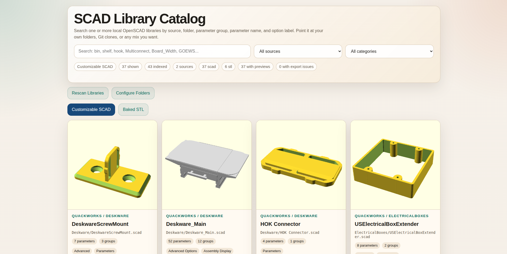
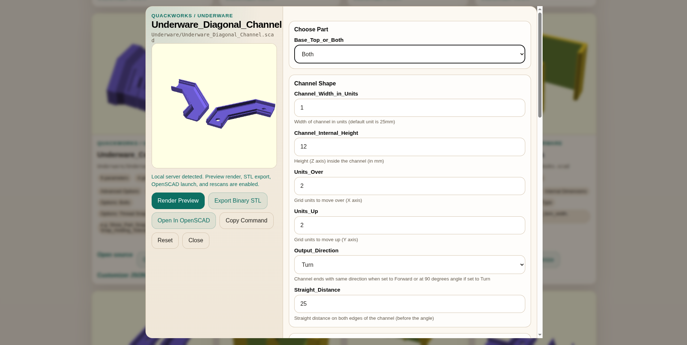

# SCAD Catalog

`scad-catalog` is a local browser UI for OpenSCAD and STL libraries.

It can:

- scan one or more OpenSCAD source folders
- render preview images
- expose OpenSCAD Customizer parameters
- export binary STL files
- open source `.scad` files in OpenSCAD
- open baked `.stl` files directly in a slicer
- manage source folders from the browser

This repository is the tool only. It does not contain any model libraries.

## Screenshots

Catalog overview:



Customizer modal:



## License

This project is licensed under the `GNU Affero General Public License v3.0 or later` (`AGPL-3.0-or-later`).

See [LICENSE](LICENSE) for the full text.

## Requirements

- `python3`
- `openscad-nightly`
- optionally a slicer AppImage or executable if you want direct slicer launch

## Repository layout

- `tools/scad_catalog.py`
  - builds the catalog from configured sources
- `tools/scad_catalog_server.py`
  - serves the browser UI and handles preview/export/open actions
- `sources.json`
  - source library configuration
- `CATALOG.md`
  - extra usage notes

## Configure sources

Edit `sources.json`.

Example:

```json
{
  "sources": [
    {
      "id": "my-scad-library",
      "name": "My SCAD Library",
      "type": "scad",
      "path": "/path/to/scad/library",
      "libraryPaths": ["/path/to/openscad/libs"],
      "includeHelpers": false,
      "includeInProgress": false,
      "includeDeprecated": false
    },
    {
      "id": "my-stl-library",
      "name": "My STL Library",
      "type": "stl",
      "path": "/path/to/stl/folder",
      "libraryPaths": []
    }
  ]
}
```

Source fields:

- `id`: stable internal identifier
- `name`: display label in the UI
- `type`: `scad` or `stl`
- `path`: folder to scan
- `libraryPaths`: paths added to `OPENSCADPATH` for that source
- `includeHelpers`: SCAD only
- `includeInProgress`: SCAD only
- `includeDeprecated`: SCAD only

## Build the catalog

From the repo root:

```bash
python3 tools/scad_catalog.py
```

This writes:

- `.catalog/catalog.json`
- `.catalog/index.html`
- `.catalog/previews/`
- `.catalog/metadata/`
- `.catalog/wrappers/` for STL preview wrappers

Useful variants:

```bash
python3 tools/scad_catalog.py --force
python3 tools/scad_catalog.py --limit 10
python3 tools/scad_catalog.py --skip-previews
python3 tools/scad_catalog.py --config /path/to/other-sources.json
```

## Run the local app

Start the server:

```bash
python3 tools/scad_catalog_server.py
```

Then open:

```text
http://127.0.0.1:8765/.catalog/index.html
```

## UI features

The app currently supports:

- a `Customizable SCAD` tab
- a `Baked STL` tab
- source filtering
- rescan from the browser
- folder/source editing from the browser
- OpenSCAD launch for `.scad` entries
- slicer launch for `.stl` entries

## Notes

- SCAD previews are rendered by `openscad-nightly`
- STL previews are also rendered by `openscad-nightly` through generated wrapper `.scad` files
- the server defaults to `openscad-nightly`
- slicer launch is optional and configurable from the server command line
